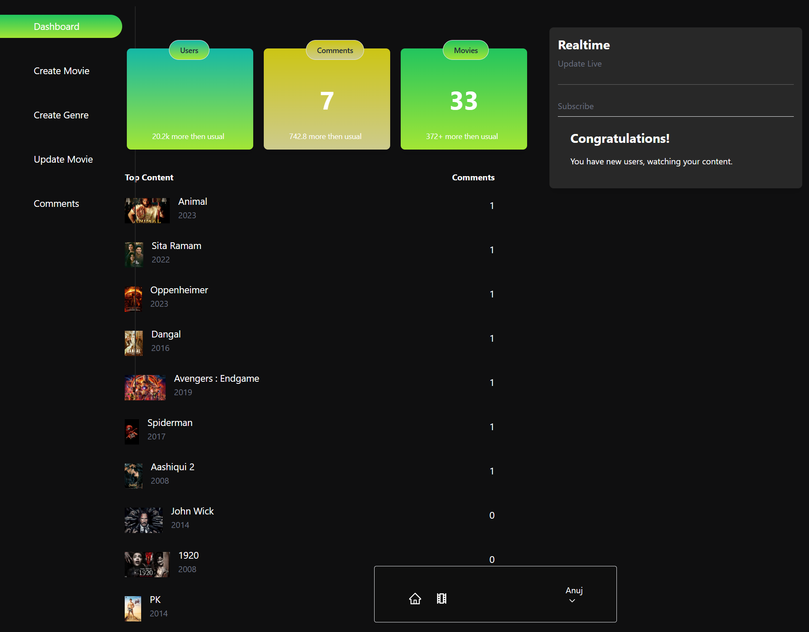

# 🎬 Movies Discovery Portal  

A **full-stack MERN** application for exploring, filtering, and managing movies with an intuitive user interface and powerful admin controls.  

---

## ✨ Features  

- **🎯 Advanced Filtering Options**  
  Filter movies by **genre**, **release year**, and categories (*Top Rated*, *New Releases*, *Random Picks*).  

- **🔐 Role-Based Access Control**  
  - **Admin**: Add, update, and delete movies/genres, view and manage user comments.  
  - **User**: Browse movies, search, and leave reviews.  

- **📊 Admin Dashboard**  
  A clean dashboard to manage movies, genres, and user interactions.  

- **🛡️ Secure Authentication**  
  Implemented JWT-based login & registration with bcrypt password hashing.  

- **🖼️ Image Hosting**  
  Cloudinary integration for secure and fast movie poster storage.  

- **⚡ State Management**  
  Redux Toolkit + RTK Query for efficient API calls and state handling.  

- **📱 Responsive Design**  
  Works smoothly across desktops, tablets, and mobiles.  

---

## 🛠 Tech Stack  

| Frontend       | Backend         | Database | Hosting   | Auth  |
|----------------|----------------|----------|-----------|-------|
| React.js       | Node.js        | MongoDB  | Cloudinary| JWT   |
| Redux Toolkit  | Express.js     |          |           | bcrypt|

---

## 📸 Screenshots  

### Homepage  
  

### Admin Dashboard  
  

### Movie Details Page  
  

---

## 🔗 Live Demo & Repository  

- 🌐 **Live Demo:** [Click Here](https://your-live-link.com)  
- 💻 **GitHub Repo:** [Click Here](https://github.com/your-username/movies-discovery-portal)  

---
